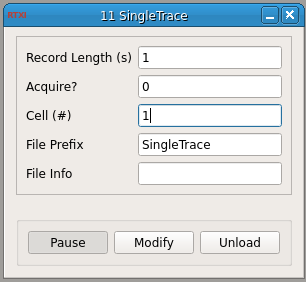

###Single Trace 

**Requirements:** None  
**Limitations:** None  

<!--start-->
This module records a single trace and nothing more.
<!--end-->

####Input Channels
1. input(0) - Vin

###Output Channels
None

####Parameters
1. Record Length (s) - How many seconds to record
2. Acquire? - 0 = no, 1 = yes
3. Cell (#)

####States
None
